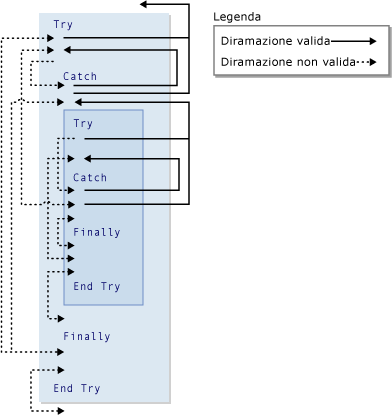

# GoTo Statement
[!INCLUDE[vs2017banner](../../../visual-basic/developing-apps/includes/vs2017banner.md)]

Esegue il branching non condizionale in una riga specificata in una routine.  
  
## Sintassi  
  
```  
GoTo line  
```  
  
## Parte  
 `line`  
 Obbligatorio.  Qualsiasi etichetta di riga.  
  
## Note  
 L'istruzione `GoTo` consente la creazione di un branch nelle sole righe della routine in cui è inclusa.  La riga deve possedere un'etichetta di riga a cui `GoTo` possa fare riferimento.  Per ulteriori informazioni, vedere [How to: Label Statements](../../../visual-basic/programming-guide/program-structure/how-to-label-statements.md).  
  
> [!NOTE]
>  Le istruzioni `GoTo` possono ostacolare la lettura e la gestione del codice.  Quando possibile, utilizzare invece una struttura di controllo.  Per ulteriori informazioni, vedere [Control Flow](../../../visual-basic/programming-guide/language-features/control-flow/index.md).  
  
 Non è possibile utilizzare un'istruzione `GoTo` per creare un branch dall'esterno di una costruzione `For`...`Next`, `For Each`...`Next`, `SyncLock`...`End SyncLock`, `Try`...`Catch`...`Finally`, `With`...`End With` o `Using`...`End Using` in un'etichetta al suo interno.  
  
## Branching e costruzioni Try  
 All'interno di una costruzione `Try`...`Catch`...`Finally`, è necessario rispettare le seguenti regole per il branching con l'istruzione `GoTo`.  
  
|Blocco o area|Branching dall'esterno|Branching all'esterno|  
|-------------------|----------------------------|---------------------------|  
|Blocco `Try`|Solo da un blocco `Catch` della stessa costruzione <sup>1</sup>|Solo al di fuori dell'intera costruzione|  
|Blocco `Catch`|Non consentito|Solo al di fuori dell'intera costruzione o del blocco `Try` della stessa costruzione <sup>1</sup>|  
|Blocco `Finally`|Non consentito|Non consentito|  
  
 <sup>1</sup> Se una costruzione `Try`...`Catch`...`Finally` è annidata in un'altra costruzione, è possibile prevedere la creazione di un branch di un blocco `Catch` all'interno del blocco `Try` del proprio livello di annidamento, ma non all'interno di un altro blocco `Try`.  Una costruzione annidata `Try`...`Catch`...`Finally` deve essere completamente contenuta in un blocco `Try` o `Catch` della costruzione in cui è annidata.  
  
 Nell'illustrazione che segue viene mostrata una costruzione `Try` annidata all'interno di un'altra.  I diversi branch tra i blocchi delle due costruzioni vengono indicati come validi o non validi.  
  
   
Branch validi e non validi in costruzioni Try  
  
## Esempio  
 Nell'esempio riportato di seguito l'istruzione `GoTo` viene utilizzata per creare un branch nelle etichette di riga in una routine.  
  
 [!code-vb[VbVbalrStatements#31](../../../visual-basic/language-reference/error-messages/codesnippet/VisualBasic/goto-statement_1.vb)]  
  
## Vedere anche  
 [Do...Loop Statement](../../../visual-basic/language-reference/statements/do-loop-statement.md)   
 [Istruzione For...Next](../../../visual-basic/language-reference/statements/for-next-statement.md)   
 [Istruzione For Each...Next](../../../visual-basic/language-reference/statements/for-each-next-statement.md)   
 [If...Then...Else Statement](../../../visual-basic/language-reference/statements/if-then-else-statement.md)   
 [Select...Case Statement](../../../visual-basic/language-reference/statements/select-case-statement.md)   
 [Try...Catch...Finally Statement](../../../visual-basic/language-reference/statements/try-catch-finally-statement.md)   
 [While...End While Statement](../../../visual-basic/language-reference/statements/while-end-while-statement.md)   
 [With...End With Statement](../../../visual-basic/language-reference/statements/with-end-with-statement.md)