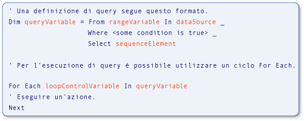

# Type Relationships in Query Operations (Visual Basic)
[!INCLUDE[vs2017banner](../../../../visual-basic/developing-apps/includes/vs2017banner.md)]

Le variabili utilizzate nelle operazioni di query [!INCLUDE[vbteclinqext](../../../../csharp/getting-started/includes/vbteclinqext-md.md)] sono fortemente tipizzate e devono essere compatibili tra loro.  La tipizzazione forte viene utilizzata nell'origine dati, nella query stessa e nell'esecuzione della query.  Nella figura seguente vengono identificati i termini utilizzati per descrivere una query [!INCLUDE[vbteclinq](../../../../csharp/includes/vbteclinq-md.md)].  Per ulteriori informazioni sulle parti di una query, vedere [Operazioni di query di base \(Visual Basic\)](../../../../visual-basic/programming-guide/concepts/linq/basic-query-operations.md).  
  
   
Parti di una query LINQ  
  
 Il tipo della variabile di intervallo nella query deve essere compatibile con il tipo degli elementi nell'origine dati.  Il tipo della variabile di query deve essere compatibile con l'elemento della sequenza definito nella clausola `Select`.  Infine, il tipo degli elementi della sequenza deve essere compatibile anche con il tipo della variabile di controllo del ciclo utilizzata nell'istruzione `For Each` che esegue la query.  Questa tipizzazione forte semplifica l'identificazione degli errori di tipo in fase di compilazione.  
  
 In [!INCLUDE[vbprvb](../../../../csharp/programming-guide/concepts/linq/includes/vbprvb-md.md)] la tipizzazione forte viene applicata implementando l'inferenza del tipo di variabile locale, nota anche come *tipizzazione implicita*.  Questa funzionalità viene utilizzata nell'esempio precedente e in tutti gli esempi e nella documentazione [!INCLUDE[vbteclinq](../../../../csharp/includes/vbteclinq-md.md)].  In Visual Basic l'inferenza del tipo di variabile locale viene eseguita semplicemente utilizzando un'istruzione `Dim` senza una clausola `As`.  Nell'esempio seguente `city` è fortemente tipizzato come stringa.  
  
 [!code-vb[VbLINQTypeRels#1](../../../../visual-basic/programming-guide/concepts/linq/codesnippet/visualbasic/type-relationships-in-qu_1.vb)]  
  
> [!NOTE]
>  L'inferenza del tipo di variabile locale funziona solo quando `Option Infer` è impostato su `On`.  Per ulteriori informazioni, vedere [Option Infer Statement](../../../../visual-basic/language-reference/statements/option-infer-statement.md).  
  
 Tuttavia, anche se si utilizza l'inferenza del tipo di variabile locale in una query, le stesse relazioni tra i tipi sono presenti tra le variabili nell'origine dati, la variabile di query e il ciclo di esecuzione della query.  È utile avere una comprensione di base di queste relazioni tra i tipi quando si scrivono le query [!INCLUDE[vbteclinq](../../../../csharp/includes/vbteclinq-md.md)] o si utilizzano gli esempi e gli esempi di codice presenti nella documentazione.  
  
 Potrebbe essere necessario specificare un tipo esplicito per una variabile di intervallo che non corrisponde al tipo restituito dall'origine dati.  È possibile specificare il tipo della variabile di intervallo utilizzando una clausola `As`.  In questo modo, tuttavia, viene restituito un errore se la conversione è una [conversione verso un tipo di dati più piccolo](../../../../visual-basic/programming-guide/language-features/data-types/widening-and-narrowing-conversions.md) e `Option Strict` è impostato su `On`.  Si consiglia pertanto di eseguire la conversione sui valori recuperati dall'origine dati.  È possibile convertire i valori dall'origine dati nel tipo di variabile di intervallo esplicito utilizzando il metodo <xref:System.Linq.Enumerable.Cast%2A>.  È inoltre possibile eseguire il cast dei valori selezionati nella clausola `Select` a un tipo esplicito diverso dal tipo della variabile di intervallo.  Questi punti vengono illustrati nel codice seguente.  
  
 [!code-vb[VbLINQTypeRels#4](../../../../visual-basic/programming-guide/concepts/linq/codesnippet/visualbasic/type-relationships-in-qu_2.vb)]  
  
## Query che restituiscono elementi dell'origine dati completi  
 Nell'esempio seguente viene illustrata un'operazione di query [!INCLUDE[vbteclinq](../../../../csharp/includes/vbteclinq-md.md)] che restituisce una sequenza di elementi selezionati dai dati di origine.  Il database di origine, `names`, contiene una matrice di stringhe e il risultato della query è una sequenza contenente stringhe che iniziano con la lettera M.  
  
 [!code-vb[VbLINQTypeRels#2](../../../../visual-basic/programming-guide/concepts/linq/codesnippet/visualbasic/type-relationships-in-qu_3.vb)]  
  
 Questo equivale al codice seguente, ma è molto più breve e facile da scrivere.  L'utilizzo dell'inferenza del tipo di variabile locale nelle query è lo stile preferito in Visual Basic.  
  
 [!code-vb[VbLINQTypeRels#3](../../../../visual-basic/programming-guide/concepts/linq/codesnippet/visualbasic/type-relationships-in-qu_4.vb)]  
  
 Le relazioni riportate di seguito sono presenti in entrambi gli esempi di codice precedenti, indipendentemente dal fatto che i tipi vengano determinati in modo implicito o esplicito.  
  
1.  Il tipo degli elementi nell'origine dati, `names`, è il tipo della variabile di intervallo, `name`, nella query.  
  
2.  Il tipo dell'oggetto selezionato, `name`, determina il tipo della variabile di query `mNames`.  In questo caso `name` è una stringa, pertanto la variabile di query è IEnumerable\(Of String\) in Visual Basic.  
  
3.  La query definita in `mNames` viene eseguita nel ciclo `For Each`.  Il ciclo scorre il risultato dell'esecuzione della query.  Poiché `mNames`, quando viene eseguito, restituisce una sequenza di stringhe, anche la variabile di iterazione del ciclo, `nm`, è una stringa.  
  
## Query che restituiscono un campo dagli elementi selezionati  
 Nell'esempio seguente viene illustrata un'operazione di query [!INCLUDE[vbtecdlinq](../../../../csharp/includes/vbtecdlinq-md.md)] che restituisce una sequenza contenente solo una parte di ogni elemento selezionato dall'origine dati.  La query utilizza una raccolta di oggetti `Customer` come origine dati e proietta solo la proprietà `Name` nel risultato.  Poiché il nome cliente è una stringa, la query genera una sequenza di stringhe come output.  
  
<CodeContentPlaceHolder>0</CodeContentPlaceHolder>  
 Le relazioni tra le variabili sono simili a quelle riportate nell'esempio più semplice.  
  
1.  Il tipo degli elementi nell'origine dati, `customers`, è il tipo della variabile di intervallo, `cust`, nella query.  In questo esempio, il tipo è `Customer`.  
  
2.  L'istruzione `Select` restituisce la proprietà `Name` di ogni oggetto `Customer` anziché l'intero oggetto.  Poiché `Name` è una stringa, la variabile di query, `custNames`, sarà di nuovo IEnumerable\(Of String\), non `Customer`.  
  
3.  Poiché `custNames` rappresenta una sequenza di stringhe, la variabile di iterazione del ciclo `For Each`, `custName`, deve essere una stringa.  
  
 Senza l'inferenza del tipo di variabile locale, l'esempio precedente risulterebbe più complesso da scrivere e da comprendere, come illustrato nell'esempio seguente.  
  
<CodeContentPlaceHolder>1</CodeContentPlaceHolder>  
## Query che richiedono tipi anonimi  
 Nell'esempio seguente viene illustrata una situazione più complessa.  Nell'esempio precedente non era utile specificare i tipi per tutte le variabili in modo esplicito.  In questo esempio non è possibile.  Anziché selezionare gli elementi `Customer` completi dall'origine dati o un singolo campo da ogni elemento, la clausola `Select` in questa query restituisce due proprietà dell'oggetto `Customer` originale: `Name` e `City`.  In risposta alla clausola `Select`, il compilatore definisce un tipo anonimo che contiene quelle due proprietà.  Il risultato dell'esecuzione di `nameCityQuery` nel ciclo `For Each` è una raccolta di istanze del nuovo tipo anonimo.  Poiché il tipo anonimo non ha un nome utilizzabile, non è possibile specificare il tipo di `nameCityQuery` o `custInfo` in modo esplicito.  Ovvero, con un tipo anonimo non è disponibile alcun nome del tipo da utilizzare al posto di `String` in `IEnumerable(Of String)`.  Per ulteriori informazioni, vedere [Anonymous Types](../../../../visual-basic/programming-guide/language-features/objects-and-classes/anonymous-types.md).  
  
<CodeContentPlaceHolder>2</CodeContentPlaceHolder>  
 Anche se non è possibile specificare i tipi per tutte le variabili nell'esempio precedente, le relazioni restano invariate.  
  
1.  Il tipo degli elementi nell'origine dati è ancora una volta il tipo della variabile di intervallo nella query.  In questo esempio `cust` è un'istanza di `Customer`.  
  
2.  Poiché l'istruzione `Select` genera un tipo anonimo, la variabile di query, `nameCityQuery`, deve essere tipizzata in modo implicito come tipo anonimo.  Un tipo anonimo non ha un nome utilizzabile e pertanto non può essere specificato in modo esplicito.  
  
3.  Il tipo della variabile di iterazione nel ciclo `For Each` è il tipo anonimo creato nel passaggio 2.  Poiché il tipo non dispone di nomi utilizzabili, il tipo della variabile di iterazione del ciclo deve essere determinato in modo implicito.  
  
## Vedere anche  
 [Getting Started with LINQ in Visual Basic](../../../../visual-basic/programming-guide/concepts/linq/getting-started-with-linq.md)   
 [Anonymous Types](../../../../visual-basic/programming-guide/language-features/objects-and-classes/anonymous-types.md)   
 [Local Type Inference](../../../../visual-basic/programming-guide/language-features/variables/local-type-inference.md)   
 [Introduction to LINQ in Visual Basic](../../../../visual-basic/programming-guide/language-features/linq/introduction-to-linq.md)   
 [LINQ](../../../../visual-basic/programming-guide/language-features/linq/index.md)   
 [Queries](../../../../visual-basic/language-reference/queries/queries.md)