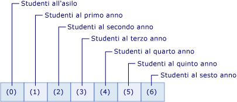

# <a name="arrays-in-visual-basic"></a>Matrici in Visual Basic
Una matrice è costituita da un insieme di valori logicamente correlati tra loro, ad esempio il numero degli studenti iscritti a ciascun anno scolastico di una scuola elementare.  Per informazioni sulle matrici in Visual Basic for Applications (VBA), vedere la [documentazione di riferimento del linguaggio](https://msdn.microsoft.com/library/office/gg264383\(v=office.14\).aspx).  
  
 Una matrice permette di fare riferimento ai valori correlati tramite lo stesso nome e usare un numero, denominato indice, per distinguere i valori. I singoli valori sono denominati elementi della matrice e sono contigui, dall'indice 0 al valore di indice più alto.  
  
 A differenza di una matrice, una variabile che contiene un singolo valore è denominata variabile *scalare* .  
  
 Di seguito sono riportati alcuni esempi:  
  
```vb  
'Declare a single-dimension array of 5 values  
Dim numbers(4) As Integer   
  
‘Declare a single-dimension array and set array element values  
Dim numbers = New Integer() {1, 2, 4, 8}  
  
 ‘Redefine the size of an existing array retaining the current values  
ReDim Preserve numbers(15)  
  
 ‘Redefine the size of an existing array, resetting the values  
ReDim numbers(15)  
  
‘Declare a multi-dimensional array  
Dim matrix(5, 5) As Double  
  
‘Declare a multi-dimensional array and set array element values  
Dim matrix = New Integer(4, 4) {{1, 2}, {3, 4}, {5, 6}, {7, 8}}  
  
 ‘Declare a jagged array  
Dim sales()() As Double = New Double(11)() {}  
```  
  
 **Contenuto dell'argomento**  
  
-   [Elementi di matrice in una matrice semplice](#BKMK_ArrayElements)  
  
-   [Creazione di una matrice](#BKMK_CreatingAnArray)  
  
-   [Archiviazione di valori in una matrice](#BKMK_StoringValues)  
  
-   [Popolamento di una matrice con valori iniziali](#BKMK_Populating)  
  
    -   [Valori letterali di matrice annidati](#BKMK_NestedArrayLiterals)  
  
-   [Scorrimento di una matrice](#BKMK_Iterating)  
  
-   [Matrici come valori e parametri restituiti](#BKMK_ReturnValues)  
  
-   [Matrici irregolari](#BKMK_JaggedArrays)  
  
-   [Matrici di lunghezza zero](#BKMK_ZeroLength)  
  
-   [Dimensione della matrice](#BKMK_ArraySize)  
  
-   [Tipi di matrice e altri tipi](#BKMK_ArrayTypes)  
  
-   [Raccolte come alternativa alle matrici](#BKMK_Collections)  
  
##  <a name="BKMK_ArrayElements"></a> Elementi di matrice in una matrice semplice  
 L'esempio seguente descrive come dichiarare una variabile di matrice che deve contenere il numero degli studenti iscritti a ciascun anno scolastico di una scuola elementare.  
  
 [!code-vb[VbVbalrArrays#2](../../../../visual-basic/programming-guide/language-features/arrays/codesnippet/VisualBasic/index_1.vb)]  
  
 La matrice `students` dell'esempio precedente contiene sette elementi. Gli indici degli elementi sono compresi tra 0 e 6. L'uso di questa matrice è più semplice rispetto alla dichiarazione di sette variabili.  
  
 La figura seguente illustra la matrice `students`. Per ogni elemento della matrice:  
  
-   L'indice dell'elemento rappresenta l'anno scolastico (l'indice 0 rappresenta l'asilo).  
  
-   Il valore contenuto nell'elemento rappresenta il numero degli studenti iscritti a tale anno scolastico.  
  
   
Elementi della matrice "students"  
  
 L'esempio seguente illustra come fare riferimento al primo, al secondo e all'ultimo elemento della matrice `students`.  
  
 [!code-vb[VbVbalrArrays#3](../../../../visual-basic/programming-guide/language-features/arrays/codesnippet/VisualBasic/index_2.vb)]  
  
 Per fare riferimento all'intera matrice è sufficiente usare il nome della variabile di matrice senza indici.  
  
 La matrice `students` nell'esempio precedente usa un unico indice ed è detta unidimensionale. Una matrice che usa più indici è detta multidimensionale. Per altre informazioni, vedere il resto di questo argomento e [Array Dimensions in Visual Basic](../../../../visual-basic/programming-guide/language-features/arrays/array-dimensions.md).  
  
##  <a name="BKMK_CreatingAnArray"></a> Creazione di una matrice  
 La dimensione di una matrice può essere definita in vari modi. È possibile specificare la dimensione quando la matrice viene dichiarata, come illustra l'esempio seguente.  
  
 [!code-vb[VbVbalrArrays#12](../../../../visual-basic/programming-guide/language-features/arrays/codesnippet/VisualBasic/index_3.vb)]  
  
 È anche possibile usare la clausola `New` per specificare la dimensione della matrice quando viene creata, come illustra l'esempio seguente.  
  
 [!code-vb[VbVbalrArrays#11](../../../../visual-basic/programming-guide/language-features/arrays/codesnippet/VisualBasic/index_4.vb)]  
  
 Se è disponibile una matrice esistente, è possibile ridefinirne la dimensione usando l'istruzione `Redim` . È possibile specificare che l'istruzione `Redim` mantenga i valori attualmente presenti nella matrice oppure fare in modo che crei una matrice vuota. L'esempio seguente illustra vari modi di usare l'istruzione `Redim` per modificare la dimensione di una matrice esistente.  
  
 [!code-vb[VbVbalrArrays#13](../../../../visual-basic/programming-guide/language-features/arrays/codesnippet/VisualBasic/index_5.vb)]  
  
 Per altre informazioni, vedere [Istruzione ReDim](../../../../visual-basic/language-reference/statements/redim-statement.md).  
  
##  <a name="BKMK_StoringValues"></a> Archiviazione di valori in una matrice  
 È possibile accedere a ogni posizione in una matrice usando un indice di tipo `Integer`. È possibile archiviare e recuperare i valori in una matrice facendo riferimento a ogni posizione della matrice tramite il relativo indice racchiuso tra parentesi. Gli indici per le matrici multidimensionali sono separati da virgole (,). È necessario un indice per ogni dimensione della matrice. L'esempio seguente illustra alcune istruzioni che consentono di inserire valori nelle matrici.  
  
 [!code-vb[VbVbalrArrays#5](../../../../visual-basic/programming-guide/language-features/arrays/codesnippet/VisualBasic/index_6.vb)]  
  
 L'esempio seguente illustra alcune istruzioni che consentono di ottenere valori dalle matrici.  
  
 [!code-vb[VbVbalrArrays#6](../../../../visual-basic/programming-guide/language-features/arrays/codesnippet/VisualBasic/index_7.vb)]  
  
##  <a name="BKMK_Populating"></a> Popolamento di una matrice con valori iniziali  
 Usando un valore letterale di matrice, è possibile creare una matrice contenente un set iniziale di valori. Un valore letterale di matrice è costituito da un elenco di valori delimitati da virgole racchiusi tra parentesi graffe (`{}`).  
  
 Quando si usa un valore letterale di matrice per creare una matrice, è possibile specificare il tipo o usare l'inferenza del tipo per determinare il tipo di matrice. Il codice seguente illustra entrambe le opzioni.  
  
 [!code-vb[VbVbalrCollectionInitializers#3](../../../../visual-basic/programming-guide/language-features/arrays/codesnippet/VisualBasic/index_8.vb)]  
  
 Quando si usa l'inferenza del tipo, il tipo della matrice viene determinato dal tipo dominante nell'elenco di valori fornito per il valore letterale di matrice. Il tipo dominante è un tipo univoco in cui tutti gli altri tipi nel valore letterale di matrice possono ampliarsi. Se non è possibile determinare il tipo univoco, il tipo dominante è il tipo univoco in cui possono restringersi tutti gli altri tipi nella matrice. Se nessuno di questi tipi univoci può essere determinato, il tipo dominante è `Object`. Se, ad esempio, l'elenco di valori fornito al valore letterale di matrice contiene valori di tipo `Integer`, `Long`e `Double`, la matrice risultante è di tipo `Double`. Sia `Integer` che `Long` possono ampliarsi solo nel tipo `Double`. `Double` è pertanto il tipo dominante. Per altre informazioni, vedere [Widening and Narrowing Conversions](../../../../visual-basic/programming-guide/language-features/data-types/widening-and-narrowing-conversions.md). Queste regole di inferenza si applicano ai tipi dedotti per le matrici che sono variabili locali definite in un membro di classe. Anche se è possibile usare valori letterali di matrice quando si creano variabili a livello di classe, non è possibile usare l'inferenza del tipo a livello di classe. Di conseguenza, i valori letterali di matrice specificati a livello di classe consentono di dedurre i valori forniti per il valore letterale di matrice come tipo `Object`.  
  
 È possibile specificare in modo esplicito il tipo di elementi in una matrice creata usando un valore letterale di matrice. In tal caso, i valori nel valore letterale di matrice devono potersi ampliare al tipo degli elementi della matrice. L'esempio di codice seguente consente di creare una matrice di tipo `Double` da un elenco di numeri interi.  
  
 [!code-vb[VbVbalrCollectionInitializers#4](../../../../visual-basic/programming-guide/language-features/arrays/codesnippet/VisualBasic/index_9.vb)]  
  
###  <a name="BKMK_NestedArrayLiterals"></a> Valori letterali di matrice annidati  
 È possibile creare una matrice multidimensionale tramite valori letterali di matrice annidati. Questi valori devono avere una dimensione e un numero di dimensioni, o rango, coerenti con la matrice risultante. L'esempio di codice seguente consente di creare una matrice bidimensionale di numeri interi usando un valore letterale di matrice.  
  
 [!code-vb[VbVbalrCollectionInitializers#7](../../../../visual-basic/programming-guide/language-features/arrays/codesnippet/VisualBasic/index_10.vb)]  
  
 Nell'esempio precedente, si verifica un errore se il numero di elementi nei valori letterali di matrice annidati non corrisponde. Si può verificare un errore anche nel caso in cui la variabile di matrice venga dichiarata in modo esplicito come diversa da bidimensionale.  
  
> [!NOTE]
>  Per evitare di generare un errore quando si specificano valori letterali di matrice annidati di dimensioni diverse, è possibile racchiudere i valori letterali di matrice interni tra parentesi. Le parentesi forzano la valutazione dell'espressione del valore letterale di matrice e i valori risultanti vengono usati con il valore letterale di matrice esterno, come mostra il codice seguente.  
  
 [!code-vb[VbVbalrCollectionInitializers#11](../../../../visual-basic/programming-guide/language-features/arrays/codesnippet/VisualBasic/index_11.vb)]  
  
 Quando si crea una matrice multidimensionale tramite valori letterali di matrice annidati, è possibile usare l'inferenza del tipo. Quando si usa l'inferenza del tipo, il tipo dedotto è il tipo dominante per tutti i valori in tutti i valori letterali di matrice per un livello di annidamento. L'esempio di codice seguente consente di creare una matrice bidimensionale di tipo `Double` da valori di tipo `Integer` e `Double`.  
  
 [!code-vb[VbVbalrCollectionInitializers#8](../../../../visual-basic/programming-guide/language-features/arrays/codesnippet/VisualBasic/index_12.vb)]  
  
 Per altri esempi, vedere [Procedura: inizializzare una variabile di matrice in Visual Basic](../../../../visual-basic/programming-guide/language-features/arrays/how-to-initialize-an-array-variable.md).  
  
##  <a name="BKMK_Iterating"></a> Scorrimento di una matrice  
 Quando si scorre una matrice, è possibile accedere a ogni elemento nella matrice dall'indice più basso all'indice più alto.  
  
 L'esempio seguente illustra come scorrere una matrice unidimensionale usando l'[istruzione For...Next](../../../../visual-basic/language-reference/statements/for-next-statement.md). Il metodo <xref:System.Array.GetUpperBound%2A> restituisce il valore più alto che l'indice possa avere. Il valore più basso dell'indice è sempre 0.  
  
 [!code-vb[VbVbalrArrays#41](../../../../visual-basic/programming-guide/language-features/arrays/codesnippet/VisualBasic/index_13.vb)]  
  
 L'esempio seguente illustra come scorrere una matrice multidimensionale usando un'istruzione `For...Next` . Il metodo <xref:System.Array.GetUpperBound%2A> ha un parametro che specifica la dimensione. `GetUpperBound(0)` restituisce il valore di indice massimo per la prima dimensione e `GetUpperBound(1)` restituisce il valore di indice massimo per la seconda dimensione.  
  
 [!code-vb[VbVbalrArrays#42](../../../../visual-basic/programming-guide/language-features/arrays/codesnippet/VisualBasic/index_14.vb)]  
  
 L'esempio seguente illustra come scorrere una matrice unidimensionale usando un'[istruzione For Each...Next](../../../../visual-basic/language-reference/statements/for-each-next-statement.md).  
  
 [!code-vb[VbVbalrArrays#43](../../../../visual-basic/programming-guide/language-features/arrays/codesnippet/VisualBasic/index_15.vb)]  
  
 L'esempio seguente illustra come scorrere una matrice multidimensionale usando un'istruzione `For Each...Next` . Per avere un controllo maggiore sugli elementi di una matrice multidimensionale è preferibile usare un'istruzione `For…Next` annidata, come nell'esempio precedente, anziché un'istruzione `For Each…Next` .  
  
 [!code-vb[VbVbalrArrays#44](../../../../visual-basic/programming-guide/language-features/arrays/codesnippet/VisualBasic/index_16.vb)]  
  
##  <a name="BKMK_ReturnValues"></a> Matrici come valori e parametri restituiti  
 Per restituire una matrice da una routine `Function`, specificare il tipo di dati della matrice e il numero di dimensioni come tipo restituito dell'[istruzione Function](../../../../visual-basic/language-reference/statements/function-statement.md). All'interno della funzione dichiarare una variabile di matrice locale con lo stesso tipo di dati degli elementi e lo stesso numero di dimensioni. Includere la variabile di matrice locale senza parentesi nell'[istruzione Return](../../../../visual-basic/language-reference/statements/return-statement.md).  
  
 Per specificare una matrice come parametro in una routine `Sub` o `Function` , definire il parametro come matrice con un tipo di dati e un numero di dimensioni specificati. Nella chiamata alla routine, inviare una variabile di matrice con lo stesso tipo di dati e numero di dimensioni.  
  
 Nell'esempio seguente, la funzione `GetNumbers` restituisce un `Integer()`. Questo tipo di matrice è una matrice unidimensionale di tipo `Integer`. La routine `ShowNumbers` accetta un argomento `Integer()` .  
  
 [!code-vb[VbVbalrArrays#51](../../../../visual-basic/programming-guide/language-features/arrays/codesnippet/VisualBasic/index_17.vb)]  
  
 Nell'esempio seguente, la funzione `GetNumbersMultiDim` restituisce un `Integer(,)`. Questo tipo di matrice è una matrice bidimensionale di tipo `Integer`.  La routine `ShowNumbersMultiDim` accetta un argomento `Integer(,)` .  
  
 [!code-vb[VbVbalrArrays#52](../../../../visual-basic/programming-guide/language-features/arrays/codesnippet/VisualBasic/index_18.vb)]  
  
##  <a name="BKMK_JaggedArrays"></a> Matrici irregolari  
 Una matrice in cui gli elementi sono costituiti da altre matrici è detta matrice di matrici o matrice irregolare. Una matrice irregolare e ogni elemento di una matrice irregolare possono avere una o più dimensioni. In alcuni casi la struttura dei dati nell'applicazione è bidimensionale, ma non rettangolare.  
  
 L'esempio seguente illustra una matrice di mesi, in cui ogni elemento della matrice è costituito da una matrice di giorni. Poiché il numero di giorni varia a seconda del mese, gli elementi non formano una matrice bidimensionale rettangolare. In tal caso si usa una matrice irregolare anziché una matrice multidimensionale.  
  
 [!code-vb[VbVbalrArrays#21](../../../../visual-basic/programming-guide/language-features/arrays/codesnippet/VisualBasic/index_19.vb)]  
  
##  <a name="BKMK_ZeroLength"></a> Matrici di lunghezza zero  
 Una matrice che non contiene elementi viene definita anche matrice di lunghezza zero. Il valore di una variabile che contiene una matrice di lunghezza zero non è `Nothing`. Per creare una matrice senza elementi, dichiarare una delle dimensioni della matrice come -1, come illustra l'esempio seguente.  
  
 [!code-vb[VbVbalrArrays#14](../../../../visual-basic/programming-guide/language-features/arrays/codesnippet/VisualBasic/index_20.vb)]  
  
 Potrebbe essere necessario creare una matrice di lunghezza zero nelle circostanze seguenti:  
  
-   Senza correre il rischio di generare un'eccezione <xref:System.NullReferenceException>, il codice deve accedere ai membri della classe <xref:System.Array>, ad esempio <xref:System.Array.Length%2A> o <xref:System.Array.Rank%2A> oppure chiamare una funzione [!INCLUDE[vbprvb](../../../../csharp/programming-guide/concepts/linq/includes/vbprvb_md.md)], come ad esempio <xref:Microsoft.VisualBasic.Information.UBound%2A>.  
  
-   È consigliabile semplificare il codice che la usa escludendo la verifica della presenza di `Nothing` come caso particolare.  
  
-   Il codice interagisce con un'API (Application Programming Interface) che richiede il passaggio di una matrice di lunghezza zero a una o più routine oppure che restituisce una matrice di lunghezza zero da una o più routine.  
  
##  <a name="BKMK_ArraySize"></a> Dimensione della matrice  
 La dimensione di una matrice è il prodotto delle lunghezze di tutte le relative dimensioni e rappresenta il numero totale di elementi attualmente contenuti nella matrice.  
  
 L'esempio seguente illustra come dichiarare una matrice tridimensionale.  
  
```  
Dim prices(3, 4, 5) As Long  
```  
  
 La dimensione complessiva della matrice nella variabile `prices` è (3 + 1) x (4 + 1) x (5 + 1) = 120.  
  
 È possibile determinare le dimensioni di una matrice usando la proprietà <xref:System.Array.Length%2A>. È possibile determinare la lunghezza di ogni dimensione di una matrice multidimensionale usando il metodo <xref:System.Array.GetLength%2A>.  
  
 Per ridimensionare una variabile di matrice è possibile assegnare un nuovo oggetto matrice o usare l'istruzione `ReDim` .  
  
 Di seguito sono indicati alcuni elementi importanti relativi alla dimensione di una matrice.  
  
|||  
|---|---|  
|Lunghezza delle dimensioni|L'indice di ogni dimensione è compreso tra 0 e il relativo limite superiore. La lunghezza di una determinata dimensione è quindi maggiore di 1 rispetto al limite superiore dichiarato di tale dimensione.|  
|Limiti di lunghezza|La lunghezza di ogni dimensione di una matrice è limitata al valore massimo del tipo di dati `Integer`, ovvero (2 ^ 31) - 1. La dimensione totale di una matrice, tuttavia, è limitata anche dalla memoria disponibile nel sistema. Se si tenta di inizializzare una matrice che supera la quantità di RAM disponibile, Common Language Runtime genera un'eccezione <xref:System.OutOfMemoryException>.|  
|Dimensione ed elementi della matrice|La dimensione di una matrice è indipendente dal tipo di dati dei relativi elementi. La dimensione rappresenta sempre il numero totale di elementi e non il numero di byte necessari per la loro archiviazione.|  
|Consumo di memoria|Non è possibile fare ipotesi sulla modalità di archiviazione di una matrice in memoria. L'archiviazione dipende dalla larghezza dei dati delle diverse piattaforme. Di conseguenza, è possibile che l'archiviazione di una stessa matrice richieda più memoria in un sistema a 64 bit che in un sistema a 32 bit. A seconda della configurazione di sistema al momento dell'inizializzazione di una matrice, Common Language Runtime (CLR) può assegnare la memoria in modo da compattare al massimo gli elementi oppure in modo da allinearli tutti in base ai limiti dell'hardware. Per le informazioni di controllo di una matrice è richiesto un sovraccarico di archiviazione che aumenta con ogni dimensione aggiunta.|  
  
##  <a name="BKMK_ArrayTypes"></a> Tipi di matrice e altri tipi  
 Ogni matrice ha un tipo di dati, diverso da quello dei relativi elementi. Non esiste un singolo tipo di dati per tutte le matrici. Il tipo di dati di una matrice viene invece determinato dal numero di dimensioni, o *rango*, della matrice e dal tipo di dati degli elementi nella matrice. Due variabili di matrice hanno lo stesso tipo di dati solo se hanno lo stesso numero di dimensioni e i relativi elementi includono lo stesso tipo di dati. La lunghezza delle dimensioni in una matrice non influisce sul tipo di dati della matrice.  
  
 Ogni matrice eredita dalla classe <xref:System.Array?displayProperty=fullName>. È possibile dichiarare una variabile di tipo `Array`, ma non è possibile creare una matrice di tipo `Array`. L'[istruzione ReDim](../../../../visual-basic/language-reference/statements/redim-statement.md) non può inoltre operare su una variabile dichiarata di tipo `Array`. Per questi motivi, e per garantire l'indipendenza dai tipi, è consigliabile dichiarare ogni matrice con un tipo specifico, ad esempio `Integer` nell'esempio precedente.  
  
 È possibile determinare il tipo di dati di una matrice o dei relativi elementi in diversi modi.  
  
-   È possibile chiamare il metodo <xref:System.Object.GetType%2A?displayProperty=fullName> sulla variabile per ricevere un oggetto <xref:System.Type> per il tipo della variabile in fase di esecuzione. Nelle proprietà e nei metodi dell'oggetto <xref:System.Type> sono presenti informazioni complete.  
  
-   È possibile passare la variabile alla funzione <xref:Microsoft.VisualBasic.Information.TypeName%2A> per ricevere un oggetto `String` contenente il nome del tipo in fase di esecuzione.  
  
-   È possibile passare la variabile alla funzione <xref:Microsoft.VisualBasic.Information.VarType%2A> per ricevere un valore `VariantType` che rappresenta la classificazione del tipo della variabile.  
  
 L'esempio seguente chiama la funzione `TypeName` per determinare il tipo della matrice e il tipo degli elementi nella matrice. Il tipo di matrice è `Integer(,)` e gli elementi nella matrice sono di tipo `Integer`.  
  
 [!code-vb[VbVbalrArrays#15](../../../../visual-basic/programming-guide/language-features/arrays/codesnippet/VisualBasic/index_21.vb)]  
  
##  <a name="BKMK_Collections"></a> Raccolte come alternativa alle matrici  
 Le matrici sono estremamente utili per la creazione e l'uso di un numero fisso di oggetti fortemente tipizzati. Le raccolte consentono di lavorare in modo più flessibile con gruppi di oggetti. A differenza delle matrici, il gruppo di oggetti con cui si lavora può aumentare e diminuire in modo dinamico in base alle esigenze dell'applicazione.  
  
 Per modificare la dimensione di una matrice, è necessario usare l'[istruzione ReDim](../../../../visual-basic/language-reference/statements/redim-statement.md). In questo modo, [!INCLUDE[vbprvb](../../../../csharp/programming-guide/concepts/linq/includes/vbprvb_md.md)] crea una nuova matrice e la matrice precedente viene rilasciata per l'eliminazione. Questa operazione causa un aumento del tempo di esecuzione. Di conseguenza, se il numero degli elementi usati cambia spesso oppure non è possibile prevedere il numero massimo di elementi necessari, è preferibile usare una raccolta per ottenere prestazioni migliori.  
  
 Per alcune raccolte è possibile assegnare una chiave a qualsiasi oggetto inserito nella raccolta in modo da recuperare rapidamente l'oggetto usando la chiave.  
  
 Se la raccolta contiene elementi di un solo tipo di dati, è possibile usare una delle classi nello spazio dei nomi <xref:System.Collections.Generic?displayProperty=fullName>. In una raccolta generica viene imposta l'indipendenza dai tipi, in modo da impedire che vengano aggiunti altri tipi di dati alla raccolta. Quando si recupera un elemento da una raccolta generica, non è necessario determinarne il tipo di dati né convertirlo.  
  
 Per altre informazioni sulle raccolte, vedere [Raccolte](http://msdn.microsoft.com/library/e76533a9-5033-4a0b-b003-9c2be60d185b).  
  
### <a name="example"></a>Esempio  
 L'esempio seguente usa la classe generica <xref:System.Collections.Generic.List%601?displayProperty=fullName> di [!INCLUDE[dnprdnshort](../../../../csharp/getting-started/includes/dnprdnshort_md.md)] per creare una raccolta di oggetti `Customer`.  
  
 [!code-vb[VbVbalrArrays#1](../../../../visual-basic/programming-guide/language-features/arrays/codesnippet/VisualBasic/index_22.vb)]  
  
 La dichiarazione della raccolta `CustomerFile` specifica che la raccolta può contenere soltanto elementi di tipo `Customer` e definisce anche una capacità iniziale di 200 elementi. La routine `AddNewCustomer` controlla la validità del nuovo elemento e quindi lo aggiunge alla raccolta. La routine `PrintCustomers` usa un ciclo `For Each` per attraversare la raccolta e visualizzarne gli elementi.  
  
## <a name="related-topics"></a>Argomenti correlati  
  
|Termine|Definizione|  
|----------|----------------|  
|[Array Dimensions in Visual Basic](../../../../visual-basic/programming-guide/language-features/arrays/array-dimensions.md)|Illustra il numero di dimensioni, o rango, e le dimensioni delle matrici.|  
|[Procedura: Inizializzare una variabile di matrice in Visual Basic](../../../../visual-basic/programming-guide/language-features/arrays/how-to-initialize-an-array-variable.md)|Descrive come popolare le matrici con valori iniziali.|  
|[Procedura: Ordinare una matrice in Visual Basic](../../../../visual-basic/programming-guide/language-features/arrays/how-to-sort-an-array.md)|Illustra come ordinare alfabeticamente gli elementi di una matrice.|  
|[Procedura: Assegnare una matrice a un'altra matrice](../../../../visual-basic/programming-guide/language-features/arrays/how-to-assign-one-array-to-another-array.md)|Descrive regole e passaggi per l'assegnazione di una matrice a un'altra variabile di matrice.|  
|[Risoluzione dei problemi relativi alle matrici](../../../../visual-basic/programming-guide/language-features/arrays/troubleshooting-arrays.md)|Illustra alcuni problemi comuni che si verificano quando si usano le matrici.|  
  
## <a name="see-also"></a>Vedere anche  
 <xref:System.Array>   
 [Istruzione Dim](../../../../visual-basic/language-reference/statements/dim-statement.md)   
 [Istruzione ReDim](../../../../visual-basic/language-reference/statements/redim-statement.md)

