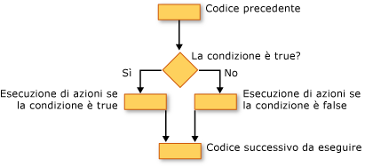

# Decision Structures (Visual Basic)
[!INCLUDE[vs2017banner](../../../../visual-basic/developing-apps/includes/vs2017banner.md)]

Con [!INCLUDE[vbprvb](../../../../csharp/programming-guide/concepts/linq/includes/vbprvb-md.md)] è possibile verificare le condizioni ed eseguire operazioni diverse in base ai risultati ottenuti.  È possibile eseguire il test di una condizione per verificare se è true o false, di diversi valori di un'espressione oppure di diverse eccezioni generate quando viene eseguita una serie di istruzioni.  
  
 La figura riportata di seguito illustra una struttura decisionale che verifica se una condizione è true ed esegue operazioni diverse a seconda che la condizione sia true o false.  
  
   
Operazioni diverse quando una condizione è true o false  
  
## Costruzione If...Then...Else  
 Le costruzioni `If...Then...Else` consentono di verificare una o più condizioni e di eseguire una o più istruzioni in base al risultato di ciascuna condizione.  Di seguito sono indicati i vari modi in cui è possibile utilizzare le condizioni per eseguire specifiche operazioni.  
  
-   Eseguire una o più istruzioni se una condizione è `True`  
  
-   Eseguire una o più istruzioni se una condizione è `False`  
  
-   Eseguire alcune istruzioni se una condizione è `True` e altre istruzioni se la condizione è `False`  
  
-   Verificare una condizione aggiuntiva se la prima condizione è `False`  
  
 L'elemento che offre tutte queste possibilità è la struttura di controllo [If...Then...Else Statement](../../../../visual-basic/language-reference/statements/if-then-else-statement.md).  Se è necessario eseguire un'unica verifica e un'unica istruzione, è possibile utilizzare una versione a riga singola.  Se, invece, è presente un set di condizioni e azioni più complesso, è possibile utilizzare la versione a più righe.  
  
## Costruzione Select...Case  
 La costruzione `Select...Case` consente di valutare un'espressione una sola volta e di eseguire set differenti di istruzioni in base ai diversi valori possibili.  Per ulteriori informazioni, vedere [Select...Case Statement](../../../../visual-basic/language-reference/statements/select-case-statement.md).  
  
## Costruzione Try...Catch...Finally  
 Le costruzioni `Try...Catch...Finally` consentono di eseguire un set di istruzioni in un ambiente che mantiene il controllo se una qualsiasi di tali istruzioni genera un'eccezione.  È possibile eseguire azioni diverse per eccezioni differenti.  È possibile eventualmente specificare un blocco di codice da eseguire prima di terminare l'intera costruzione `Try...Catch...Finally`, indipendentemente dall'esito.  Per ulteriori informazioni, vedere [Try...Catch...Finally Statement](../../../../visual-basic/language-reference/statements/try-catch-finally-statement.md).  
  
> [!NOTE]
>  Per molte strutture di controllo quando si fa clic su una parola chiave, vengono evidenziate tutte le parole chiave nella struttura.  Ad esempio, quando si fa clic su `If` in una costruzione `If...Then...Else`, vengono evidenziate tutte le istanze di `If`, `Then`, `ElseIf`, `Else` e `End If` nella costruzione.  Per spostarsi alla parola chiave evidenziata successiva o precedente, premere CTRL\+MAIUSC\+FRECCIA GIÙ o CTRL\+MAIUSC\+FRECCIA SU.  
  
## Vedere anche  
 [Control Flow](../../../../visual-basic/programming-guide/language-features/control-flow/index.md)   
 [Loop Structures](../../../../visual-basic/programming-guide/language-features/control-flow/loop-structures.md)   
 [Other Control Structures](../../../../visual-basic/programming-guide/language-features/control-flow/other-control-structures.md)   
 [Nested Control Structures](../../../../visual-basic/programming-guide/language-features/control-flow/nested-control-structures.md)   
 [If Operator](../../../../visual-basic/language-reference/operators/if-operator.md)