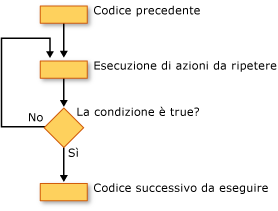

# Loop Structures (Visual Basic)
[!INCLUDE[vs2017banner](../../../../csharp/includes/vs2017banner.md)]

In [!INCLUDE[vbprvb](../../../../csharp/programming-guide/concepts/linq/includes/vbprvb_md.md)] le strutture di ciclo consentono di eseguire ripetutamente una o più righe di codice.  Le istruzioni possono essere ripetute in una struttura di ciclo fino a quando una condizione è `True` o `False` per un determinato numero di volte oppure una volta per ciascun elemento di una raccolta.  
  
 Nella figura seguente viene illustrato una struttura di ciclo che esegue un insieme di istruzioni fino a quando una determinata condizione non è true.  
  
   
Esecuzione di un'insieme di istruzioni fino a quando una condizione non è true  
  
## Cicli While  
 La costruzione `While`...`End While` esegue un insieme di istruzioni fino a quando la condizione specificata nell'istruzione `While` è `True`.  Per ulteriori informazioni, vedere [While...End While Statement](../../../../visual-basic/language-reference/statements/while-end-while-statement.md).  
  
## Cicli Do  
 La costruzione `Do`...`Loop` consente di verificare una condizione all'inizio o alla fine di una struttura di ciclo.  È anche possibile specificare l'eventuale ripetizione del ciclo fintantoché la condizione è `True` o fino a quando diventa `True`.  Per ulteriori informazioni, vedere [Do...Loop Statement](../../../../visual-basic/language-reference/statements/do-loop-statement.md).  
  
## Cicli For  
 La costruzione `For`...`Next` esegue il ciclo per il numero di volte specificato.  Per tenere traccia delle ripetizioni, viene utilizzata una variabile di controllo del ciclo, definita anche *contatore*.  È possibile specificare i valori iniziale e finale del contatore e, in maniera facoltativa, l'incremento che quest'ultimo subisce da una ripetizione alla successiva.  Per ulteriori informazioni, vedere [Istruzione For...Next](../../../../visual-basic/language-reference/statements/for-next-statement.md).  
  
## Cicli For Each  
 La costruzione `For Each`...`Next` esegue una raccolta di istruzioni una volta per ciascun elemento di una raccolta.  È possibile specificare la variabile di controllo del ciclo, mentre non è necessario definire i relativi valori iniziale e finale.  Per ulteriori informazioni, vedere [Istruzione For Each...Next](../../../../visual-basic/language-reference/statements/for-each-next-statement.md).  
  
## Vedere anche  
 [Control Flow](../../../../visual-basic/programming-guide/language-features/control-flow/index.md)   
 [Decision Structures](../../../../visual-basic/programming-guide/language-features/control-flow/decision-structures.md)   
 [Other Control Structures](../../../../visual-basic/programming-guide/language-features/control-flow/other-control-structures.md)   
 [Nested Control Structures](../../../../visual-basic/programming-guide/language-features/control-flow/nested-control-structures.md)