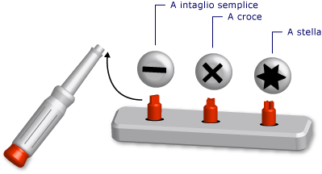

# Tipi generici in Visual Basic (Visual Basic)
[!INCLUDE[vs2017banner](../../../../visual-basic/developing-apps/includes/vs2017banner.md)]

Un *tipo generico* è un singolo elemento di programmazione che si adatta per eseguire la stessa funzionalità per diversi tipi di dati. Quando si definisce una classe o una routine generica, non è necessario definire una versione distinta per ogni tipo di dati per il quale si vuole eseguire tale funzionalità.  
  
 Un'analogia è un cacciavite con diverse punte rimovibili. Si esamina la vite che è necessario ruotare e si seleziona la punta corretta per tale vite \(a taglio, a croce, a stella\). Dopo avere inserito la punta corretta nel manico del cacciavite, si esegue in tutti i casi la stessa funzione, ovvero ruotare la vite.  
  
   
Cacciavite come strumento generico  
  
 Quando si definisce un tipo generico, questo viene parametrizzato con uno o più tipi di dati. Questo consente di usare il codice per adattare i tipi di dati ai propri requisiti. Il codice può dichiarare più elementi di programmazione dall'elemento generico, ciascuno dei quali agisce su un diverso set di tipi di dati. Tuttavia, tutti gli elementi dichiarati eseguono la stessa logica, indipendentemente dai tipi di dati in uso.  
  
 È ad esempio possibile creare e usare una classe queue che opera su un tipo di dati specifico, quale `String`. È possibile dichiarare tale classe da <xref:System.Collections.Generic.Queue%601?displayProperty=fullName>, come illustrato nell'esempio seguente.  
  
 [!code-vb[VbVbalrDataTypes#1](../../../../visual-basic/language-reference/data-types/codesnippet/VisualBasic/generic-types_1.vb)]  
  
 È ora possibile usare `stringQ` per lavorare esclusivamente con i valori `String`. Poiché `stringQ` è specifico per `String` anziché essere generalizzato per i valori `Object`, non viene eseguita alcuna associazione tardiva o conversione di tipo. Questo consente di risparmiare il tempo di esecuzione e riduce gli errori di runtime.  
  
 Per altre informazioni sull'uso di un tipo generico, vedere [Procedura: utilizzare una classe generica](../../../../visual-basic/programming-guide/language-features/data-types/how-to-use-a-generic-class.md).  
  
## Esempio di classe generica  
 Nell'esempio seguente viene illustrata la struttura della definizione di una classe generica.  
  
 [!code-vb[VbVbalrDataTypes#2](../../../../visual-basic/language-reference/data-types/codesnippet/VisualBasic/generic-types_2.vb)]  
  
 Nella struttura precedente `t` è un *parametro di tipo*, ovvero un segnaposto per un tipo di dati che viene fornito quando si dichiara la classe. In un'altra posizione nel codice è possibile dichiarare varie versioni di `classHolder` fornendo diversi tipi di dati per `t`. Gli esempi seguenti mostrano due dichiarazioni di questo tipo.  
  
 [!code-vb[VbVbalrDataTypes#3](../../../../visual-basic/language-reference/data-types/codesnippet/VisualBasic/generic-types_3.vb)]  
  
 Le istruzioni precedenti dichiarano *classi costruite*, in cui un tipo specifico sostituisce il parametro di tipo. Questa sostituzione viene propagata in tutto il codice all'interno della classe costruita. Nell'esempio seguente viene illustrato l'aspetto della routine `processNewItem` in `integerClass`.  
  
 [!code-vb[VbVbalrDataTypes#4](../../../../visual-basic/language-reference/data-types/codesnippet/VisualBasic/generic-types_4.vb)]  
  
 Per un esempio più esaustivo, vedere [Procedura: definire una classe in grado di fornire funzionalità identiche con tipi di dati diversi](../../../../visual-basic/programming-guide/language-features/data-types/how-to-define-a-class-that-can-provide-identical-functionality.md).  
  
## Elementi di programmazione idonei  
 È possibile definire e usare classi, strutture, interfacce, routine e delegati generici. Si noti che [!INCLUDE[dnprdnshort](../../../../csharp/getting-started/includes/dnprdnshort-md.md)] definisce diverse classi, strutture e interfacce generiche che rappresentano elementi generici usati comunemente. Lo spazio dei nomi <xref:System.Collections.Generic?displayProperty=fullName> fornisce dizionari, elenchi, code e stack. Prima di definire un elemento generico personalizzato, verificare se è già disponibile in <xref:System.Collections.Generic?displayProperty=fullName>.  
  
 Le routine non sono tipi, ma è possibile definire e usare routine generiche. Vedere [Generic Procedures in Visual Basic](../../../../visual-basic/programming-guide/language-features/data-types/generic-procedures.md).  
  
## Vantaggi dei tipi generici  
 Un tipo generico serve come base per dichiarare molti elementi di programmazione diversi, ognuno dei quali opera su un tipo di dati specifico. Le alternative a un tipo generico sono:  
  
1.  Un singolo tipo che opera sul tipo di dati `Object`.  
  
2.  Un set di versioni *specifiche del tipo*, ognuna codificata individualmente e che opera su un tipo di dati specifico, ad esempio `String`, `Integer` o un tipo definito dall'utente come `customer`.  
  
 Un tipo generico offre i vantaggi seguenti rispetto a queste alternative:  
  
-   **Indipendenza dai tipi.** I tipi generici applicano il controllo dei tipi in fase di compilazione. I tipi basati su `Object` accettano qualsiasi tipo di dati ed è necessario scrivere codice per verificare se un tipo di dati di input è accettabile. Con i tipi generici, il compilatore può intercettare i tipi non corrispondenti prima della fase di esecuzione.  
  
-   **Prestazioni.** I tipi generici non devono eseguire il *boxing* e l'*unboxing* dei dati, perché ognuno è specializzato per un solo tipo di dati. Le operazioni basate su `Object` devono eseguire il boxing dei tipi di dati di input per convertirli in `Object` e l'unboxing dei dati destinati all'output. Il boxing e l'unboxing riducono le prestazioni.  
  
     I tipi basati su `Object` sono anche ad associazione tardiva, il che significa che l'accesso ai membri richiede codice aggiuntivo in fase di esecuzione. Anche questo riduce le prestazioni.  
  
-   **Consolidamento del codice.** Il codice in un tipo generico deve essere definito una sola volta. Un set di versioni specifiche del tipo deve replicare lo stesso codice in ogni versione, con la sola differenza del tipo di dati specifico per tale versione. Con i tipi generici, tutte le versioni specifiche del tipo sono generate dal tipo generico originale.  
  
-   **Riutilizzo del codice.** Il codice che non dipende da un particolare tipo di dati può essere riutilizzato con vari tipi di dati se è generico. Spesso è possibile riutilizzarlo anche con un tipo di dati che non era originariamente previsto.  
  
-   **Supporto IDE.** Quando si usa un tipo costruito dichiarato da un tipo generico, l'ambiente di sviluppo integrato \(IDE\) può consentire di ottenere maggiore supporto durante lo sviluppo di codice. Ad esempio, IntelliSense può visualizzare le opzioni specifiche del tipo per un argomento di un costruttore o un metodo.  
  
-   **Algoritmi generici.** Gli algoritmi astratti indipendenti dal tipo sono buoni candidati per i tipi generici. Ad esempio, una routine generica che ordina gli elementi tramite l'interfaccia <xref:System.IComparable> può essere usata con qualsiasi tipo di dati che implementa <xref:System.IComparable>.  
  
## Vincoli  
 Sebbene il codice nella definizione di un tipo generico debba essere quanto più indipendente dal tipo possibile, potrebbe essere necessario richiedere che una determinata funzionalità di qualsiasi tipo di dati sia disponibile per il tipo generico. Ad esempio, se si vuole confrontare due elementi per ordinarli, il relativo tipo di dati deve implementare l'interfaccia <xref:System.IComparable>. È possibile applicare questo requisito aggiungendo un *vincolo* al parametro di tipo.  
  
### Esempio di vincolo  
 Nell'esempio seguente viene illustrata una struttura di definizione di una classe con un vincolo che richiede che l'argomento di tipo implementi <xref:System.IComparable>.  
  
 [!code-vb[VbVbalrDataTypes#5](../../../../visual-basic/language-reference/data-types/codesnippet/VisualBasic/generic-types_5.vb)]  
  
 Se il codice successivo tenta di costruire una classe da `itemManager` fornendo un tipo che non implementa <xref:System.IComparable>, il compilatore segnala un errore.  
  
### Tipi di vincoli  
 I vincoli possono specificare i requisiti seguenti in qualsiasi combinazione:  
  
-   L'argomento di tipo deve implementare una o più interfacce  
  
-   L'argomento di tipo deve essere del tipo di, o ereditare da, una classe al massimo  
  
-   L'argomento di tipo deve esporre un costruttore senza parametri accessibile al codice che crea oggetti in base ad esso  
  
-   L'argomento di tipo deve essere un *tipo riferimento* oppure un *tipo valore*  
  
 Se è necessario imporre più di un requisito, usare un *elenco di vincoli* separati da virgole tra parentesi graffe \(`{ }`\). Per richiedere un costruttore accessibile, includere la parola chiave [New Operator](../../../../visual-basic/language-reference/operators/new-operator.md) nell'elenco. Per richiedere un tipo di riferimento, includere la parola chiave `Class`; per richiedere un tipo di valore, includere la parola chiave `Structure`.  
  
 Per altre informazioni sui vincoli, vedere [Type List](../../../../visual-basic/language-reference/statements/type-list.md).  
  
### Esempio di più vincoli  
 Nell'esempio seguente viene illustrata una struttura di definizione di una classe generica con un elenco di vincoli per il parametro di tipo. Nel codice che crea un'istanza di questa classe, l'argomento di tipo deve implementare entrambe le interfacce <xref:System.IComparable> e <xref:System.IDisposable>, essere un tipo di riferimento ed esporre un costruttore senza parametri accessibile.  
  
 [!code-vb[VbVbalrDataTypes#6](../../../../visual-basic/language-reference/data-types/codesnippet/VisualBasic/generic-types_6.vb)]  
  
## Termini importanti  
 I tipi generici introducono e usano i termini seguenti:  
  
-   *Tipo generico*. Una definizione di una classe, una struttura, un'interfaccia, una routine o un delegato per cui si fornisce almeno un tipo di dati al momento della dichiarazione.  
  
-   *Parametro di tipo*. In una definizione di tipo generico, un segnaposto per un tipo di dati fornito al momento della dichiarazione del tipo.  
  
-   *Argomento di tipo*. Tipo di dati specifico che sostituisce un parametro di tipo quando si dichiara un tipo costruito da un tipo generico.  
  
-   *Vincolo*. Condizione su un parametro di tipo che limita l'argomento di tipo che è possibile specificare. Un vincolo può richiedere che l'argomento di tipo debba implementare un'interfaccia specifica, essere o ereditare da una classe particolare, avere un costruttore senza parametri accessibile o essere un tipo di riferimento o un tipo di valore. Questi vincoli possono essere combinati, ma è possibile specificare al massimo una classe.  
  
-   *Tipo costruito*. Una classe, una struttura, un'interfaccia, una routine o un delegato dichiarato da un tipo generico fornendo argomenti di tipo per i relativi parametri di tipo.  
  
## Vedere anche  
 [Riepilogo dei tipi di dati](../../../../visual-basic/programming-guide/language-features/data-types/index.md)   
 [Type Characters](../../../../visual-basic/programming-guide/language-features/data-types/type-characters.md)   
 [Value Types and Reference Types](../../../../visual-basic/programming-guide/language-features/data-types/value-types-and-reference-types.md)   
 [Type Conversions in Visual Basic](../../../../visual-basic/programming-guide/language-features/data-types/type-conversions.md)   
 [Troubleshooting Data Types](../../../../visual-basic/programming-guide/language-features/data-types/troubleshooting-data-types.md)   
 [Data Types](../../../../visual-basic/language-reference/data-types/data-type-summary.md)   
 [Of](../../../../visual-basic/language-reference/statements/of-clause.md)   
 [As](../../../../visual-basic/language-reference/statements/as-clause.md)   
 [Object Data Type](../../../../visual-basic/language-reference/data-types/object-data-type.md)   
 [Covarianza e controvarianza](../Topic/Covariance%20and%20Contravariance%20\(C%23%20and%20Visual%20Basic\).md)   
 [Iteratori](../Topic/Iterators%20\(C%23%20and%20Visual%20Basic\).md)