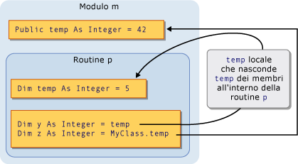
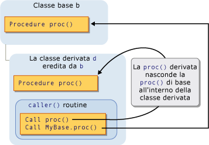

# <a name="shadowing-in-visual-basic"></a>Shadowing in Visual Basic
Quando due elementi di programmazione condividono lo stesso nome, è possibile nascondere una di esse, o *shadow*, l'altro. In questo caso, l'elemento nascosto non è disponibile per riferimento; al contrario, quando il codice utilizza il nome dell'elemento, il [!INCLUDE[vbprvb](../../../../csharp/programming-guide/concepts/linq/includes/vbprvb_md.md)] compilatore risolve tale nome nell'elemento di shadowing.  
  
## <a name="purpose"></a>Scopo  
 Lo scopo principale di shadowing è di proteggere la definizione dei membri della classe. La classe di base può essere sottoposto a una modifica che crea un elemento con lo stesso nome di uno che già definito. In questo caso, il `Shadows` modificatore impone che fa riferimento tramite la classe deve essere risolto al membro è definito, anziché il nuovo elemento di classe di base.  
  
## <a name="types-of-shadowing"></a>Tipi di Shadowing  
 Un elemento può nascondere un altro elemento in due modi diversi. L'elemento di shadowing può essere dichiarato all'interno di una sottoarea dell'area contenente l'elemento nascosto, in cui viene eseguito lo shadowing *mediante l'ambito*. O una classe derivata può ridefinire un membro di una classe base, in cui viene eseguito lo shadowing *tramite l'ereditarietà*.  
  
### <a name="shadowing-through-scope"></a>Shadowing tramite l'ambito  
 È possibile per la programmazione di elementi nella stesso modulo, classe o struttura abbiano lo stesso nome ma ambito diverso. Quando vengono dichiarati due elementi in questo modo, il codice fa riferimento al nome condividono l'elemento con ambito più ristretto nasconde l'altro elemento (ambito blocco è ristretto).  
  
 Ad esempio, un modulo è possibile definire un `Public` variabile denominata `temp`, e una routine all'interno del modulo consente di dichiarare una variabile locale denominata anche `temp`. Riferimenti agli `temp` dall'interno la procedura di accesso alla variabile locale, mentre i riferimenti a `temp` dall'esterno della routine accedono il `Public` variabile. In questo caso, la variabile della procedura `temp` nasconde la variabile del modulo `temp`.  
  
 La figura seguente mostra due variabili, entrambe denominate `temp`. La variabile locale `temp` nasconde la variabile membro `temp` quando eseguito dall'interno della relativa routine `p`. Tuttavia, il `MyClass` (parola chiave) ignora lo shadowing e accede alla variabile membro.  
  
   
Shadowing tramite l'ambito  
  
 Per un esempio di shadowing tramite l'ambito, vedere [procedura: nascondere una variabile con lo stesso nome di variabile](../../../../visual-basic/programming-guide/language-features/declared-elements/how-to-hide-a-variable-with-the-same-name-as-your-variable.md).  
  
### <a name="shadowing-through-inheritance"></a>Shadowing tramite eredità  
 Se una classe derivata ridefinisce un elemento di programmazione ereditato da una classe base, l'elemento ridefinisce nasconde l'elemento originale. È possibile nascondere qualsiasi tipo di elemento dichiarato o set di elementi in overload con qualsiasi altro tipo. Ad esempio, un `Integer` variabile può nascondere un `Function` procedura. Se si nasconde una routine con un'altra routine, è possibile utilizzare un elenco di parametri e un tipo restituito diverso.  
  
 Nella figura seguente viene illustrata una classe base `b` e una classe derivata `d` che eredita da `b`. La classe di base definisce una routine denominata `proc`, mentre la classe derivata nasconde con un'altra routine con lo stesso nome. Il primo `Call` istruzione accede lo shadowing `proc` nella classe derivata. Tuttavia, il `MyBase` (parola chiave) ignora lo shadowing e accedere alla routine nascosta nella classe di base.  
  
   
Shadowing tramite eredità  
  
 Per un esempio dello shadowing tramite eredità, vedere [procedura: nascondere una variabile con lo stesso nome di variabile](../../../../visual-basic/programming-guide/language-features/declared-elements/how-to-hide-a-variable-with-the-same-name-as-your-variable.md) e [procedura: nascondere una variabile ereditata](../../../../visual-basic/programming-guide/language-features/declared-elements/how-to-hide-an-inherited-variable.md).  
  
#### <a name="shadowing-and-access-level"></a>Shadowing e livello di accesso  
 L'elemento di shadowing non è sempre accessibile dal codice utilizzando la classe derivata. Ad esempio, potrebbe essere dichiarato `Private`. In tal caso, lo shadowing viene annullato e il compilatore risolve qualsiasi riferimento all'elemento stesso avrebbe se fosse disponibile alcun shadowing. Questo elemento è l'elemento accessibile il minor numero di derivazionali indietro passaggi dalla classe di shadowing. Se l'elemento nascosto è una procedura, la risoluzione è nella versione accessibile più vicina con lo stesso nome, elenco di parametri e il tipo restituito.  
  
 Nell'esempio seguente viene illustrata una gerarchia di ereditarietà delle tre classi. Ogni classe definisce un `Sub` procedura `display`, e ciascuna classe derivata nasconde la `display` procedura nella relativa classe base.  
  
```  
Public Class firstClass  
    Public Sub display()  
        MsgBox("This is firstClass")  
    End Sub  
End Class  
Public Class secondClass  
    Inherits firstClass  
    Private Shadows Sub display()  
        MsgBox("This is secondClass")  
    End Sub  
End Class  
Public Class thirdClass  
    Inherits secondClass  
    Public Shadows Sub display()  
        MsgBox("This is thirdClass")  
    End Sub  
End Class  
Module callDisplay  
    Dim first As New firstClass  
    Dim second As New secondClass  
    Dim third As New thirdClass  
    Public Sub callDisplayProcedures()  
        ' The following statement displays "This is firstClass".  
        first.display()  
        ' The following statement displays "This is firstClass".  
        second.display()  
        ' The following statement displays "This is thirdClass".  
        third.display()  
    End Sub  
End Module  
```  
  
 Nell'esempio precedente, la classe derivata `secondClass` ombreggiature `display` con un `Private` procedura. Quando modulo `callDisplay` chiamate `display` in `secondClass`, il codice chiamante è esterno `secondClass` e pertanto non può accedere privato `display` procedura. Lo shadowing viene annullato e il compilatore risolve il riferimento alla classe di base `display` procedura.  
  
 Tuttavia, l'altra classe derivata `thirdClass` dichiara `display` come `Public`, pertanto il codice in `callDisplay` possano accedervi.  
  
## <a name="shadowing-and-overriding"></a>Shadowing e override  
 Non confondere shadowing e override. Entrambi vengono utilizzati quando una classe derivata eredita da una classe base ed entrambi consentono di ridefinire un elemento dichiarato con un altro. Ma esistono differenze significative tra i due. Per un confronto, vedere [le differenze tra Shadowing e sostituzione](../../../../visual-basic/programming-guide/language-features/declared-elements/differences-between-shadowing-and-overriding.md).  
  
## <a name="shadowing-and-overloading"></a>Shadowing e overload  
 Se si nasconde lo stesso elemento di classe di base con più di un elemento nella classe derivata, gli elementi di shadowing diventeranno versioni di overload di tale elemento. Per ulteriori informazioni, vedere [overload di routine](../../../../visual-basic/programming-guide/language-features/procedures/procedure-overloading.md).  
  
## <a name="accessing-a-shadowed-element"></a>Accesso a un elemento nascosto  
 Quando si accede a un elemento da una classe derivata, normalmente avviene tramite l'istanza corrente della classe derivata, qualificando il nome dell'elemento con il `Me` (parola chiave). Se la classe derivata nasconde l'elemento nella classe di base, è possibile accedere all'elemento della classe base qualificandola con il `MyBase` (parola chiave).  
  
 Per un esempio di accesso a un elemento nascosto, vedere [procedura: accedere a una variabile nascosta da una classe derivata](../../../../visual-basic/programming-guide/language-features/declared-elements/how-to-access-a-variable-hidden-by-a-derived-class.md).  
  
### <a name="declaration-of-the-object-variable"></a>Dichiarazione di variabile oggetto  
 Come si crea la variabile oggetto può anche determinare se la classe derivata accede a un elemento di shadowing o all'elemento nascosto. Nell'esempio seguente crea due oggetti da una classe derivata, ma un oggetto viene dichiarato come classe di base e l'altro come classe derivata.  
  
```  
Public Class baseCls  
    ' The following statement declares the element that is to be shadowed.  
    Public z As Integer = 100  
End Class  
Public Class dervCls  
    Inherits baseCls  
    ' The following statement declares the shadowing element.  
    Public Shadows z As String = "*"  
End Class  
Public Class useClasses  
    ' The following statement creates the object declared as the base class.  
    Dim basObj As baseCls = New dervCls()  
    ' Note that dervCls widens to its base class baseCls.  
    ' The following statement creates the object declared as the derived class.  
    Dim derObj As dervCls = New dervCls()  
    Public Sub showZ()   
    ' The following statement outputs 100 (the shadowed element).  
        MsgBox("Accessed through base class: " & basObj.z)  
    ' The following statement outputs "*" (the shadowing element).  
        MsgBox("Accessed through derived class: " & derObj.z)  
    End Sub  
End Class  
```  
  
 Nell'esempio precedente, la variabile `basObj` viene dichiarata come classe di base. L'assegnazione di un `dervCls` oggetto costituisce una conversione di ampliamento e risulta quindi valido. Tuttavia, la classe di base non può accedere alla versione di shadowing della variabile `z` nella classe derivata, pertanto, il compilatore risolve `basObj.z` il valore di classe di base originale.  
  
## <a name="see-also"></a>Vedere anche  
 [Riferimenti a elementi dichiarati](../../../../visual-basic/programming-guide/language-features/declared-elements/references-to-declared-elements.md)   
 [Ambito in Visual Basic](../../../../visual-basic/programming-guide/language-features/declared-elements/scope.md)   
 [Ampliamento e restrizione conversioni](../../../../visual-basic/programming-guide/language-features/data-types/widening-and-narrowing-conversions.md)   
 [Ombreggiature](../../../../visual-basic/language-reference/modifiers/shadows.md)   
 [Esegue l'override](../../../../visual-basic/language-reference/modifiers/overrides.md)   
 [Me, My, MyBase e MyClass](../../../../visual-basic/programming-guide/program-structure/me-my-mybase-and-myclass.md)   
 [Nozioni fondamentali sull'ereditarietà](../../../../visual-basic/programming-guide/language-features/objects-and-classes/inheritance-basics.md)
