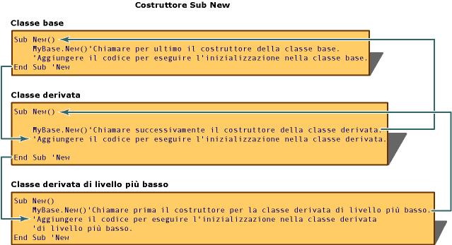
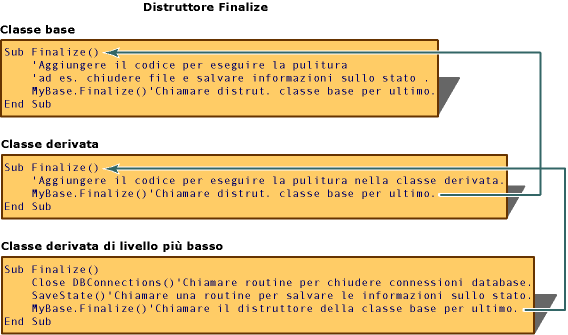

# <a name="object-lifetime-how-objects-are-created-and-destroyed-visual-basic"></a>Durata degli oggetti: come creare ed eliminare definitivamente oggetti (Visual Basic)
È stata creata un'istanza di una classe, un oggetto, mediante la parola chiave `New`. Prima di usare i nuovi oggetti per la prima volta, è spesso necessario eseguire attività di inizializzazione. Tra le attività di inizializzazione più comuni vi sono l'apertura dei file, la connessione a un database e la lettura dei valori delle chiavi del Registro di sistema. Visual Basic l'inizializzazione di nuovi oggetti mediante routine denominate *costruttori* (metodi speciali che consentono il controllo dell'inizializzazione).  
  
 Dopo aver abbandona un ambito, un oggetto viene rilasciato da Common Language Runtime (CLR). Visual Basic consente di controllare il rilascio delle risorse di sistema mediante routine denominate *distruttori*. Sia i costruttori che i distruttori supportano la creazione di librerie di classi prevedibili e affidabili.  
  
## <a name="using-constructors-and-destructors"></a>Uso di costruttori e distruttori  
 È possibile usare costruttori e distruttori per controllare la creazione e l'eliminazione di oggetti. In Visual Basic le routine `Sub New` e `Sub Finalize` consentono di inizializzare ed eliminare in modo permanente gli oggetti sostituendo i metodi `Class_Initialize` e `Class_Terminate` usati in [!INCLUDE[vbprvb](../../../../csharp/programming-guide/concepts/linq/includes/vbprvb_md.md)] 6.0 e nelle versioni precedenti.  
  
### <a name="sub-new"></a>Sub New  
 Il costruttore `Sub New` può essere eseguito solo una volta dopo la creazione di una classe. Non può essere chiamato in modo esplicito in alcun punto che non sia la prima riga di codice di un altro costruttore, dalla stessa classe o da una classe derivata. Inoltre, il codice nel metodo `Sub New` viene sempre eseguito prima di qualsiasi altro codice in una classe. [!INCLUDE[vbprvblong](../../../../visual-basic/developing-apps/customizing-extending-my/includes/vbprvblong_md.md)]e versioni successive creano in modo implicito un `Sub New` costruttore in fase di esecuzione se non si definisce in modo esplicito un `Sub New` routine per una classe.  
  
 Per creare un costruttore per una classe, creare una routine denominata `Sub New` in qualsiasi punto della definizione della classe. Per creare un costruttore con parametri, specificare i nomi e i tipi di dati degli argomenti su `Sub New` analogamente a come si specificano argomenti per qualsiasi altra routine, come illustrato nel codice seguente:  
  
 [!code-vb[VbVbalrOOP&#42;](../../../../visual-basic/misc/codesnippet/VisualBasic/object-lifetime-how-objects-are-created-and-destroyed_1.vb)]  
  
 I costruttori sono spesso in overload, come nell'esempio seguente:  
  
 [!code-vb[N.&116; VbVbalrOOP](../../../../visual-basic/misc/codesnippet/VisualBasic/object-lifetime-how-objects-are-created-and-destroyed_2.vb)]  
  
 Quando si definisce una classe derivata da un'altra classe, la prima riga di un costruttore deve essere una chiamata al costruttore della classe base, a meno che questa disponga di un costruttore accessibile che non accetta parametri. Una chiamata della classe base che contiene questo costruttore sarebbe ad esempio `MyBase.New(s)`. In caso contrario, l'oggetto `MyBase.New` è facoltativo e il runtime di [!INCLUDE[vbprvb](../../../../csharp/programming-guide/concepts/linq/includes/vbprvb_md.md)] lo chiama implicitamente.  
  
 Dopo aver scritto il codice per chiamare il costruttore di un oggetto padre, è possibile aggiungere un codice di inizializzazione alla routine `Sub New`. La routine `Sub New` può accettare gli argomenti quando viene chiamata come costruttore con parametri. Tali parametri vengono passati dalla routine che chiama il costruttore, ad esempio, `Dim AnObject As New ThisClass(X)`.  
  
### <a name="sub-finalize"></a>Sub Finalize  
 Prima di rilasciare oggetti, CLR richiede automaticamente al metodo `Finalize` gli oggetti che definiscono una routine `Sub Finalize`. È possibile che il metodo `Finalize` contenga codice che è necessario eseguire subito prima dell'eliminazione permanente di un oggetto, ad esempio codice relativo alla chiusura di file e al salvataggio delle informazioni sullo stato. L'esecuzione di `Sub Finalize` comporta una lieve riduzione delle prestazioni. Si consiglia quindi di definire un metodo `Sub Finalize` solo quando è necessario rilasciare in modo esplicito gli oggetti.  
  
> [!NOTE]
>  Il garbage collector in CLR non esiste (e non) smaltire *oggetti non gestiti*, gli oggetti che vengono eseguiti direttamente dal sistema operativo all'esterno dell'ambiente CLR. Questo perché i diversi oggetti non gestiti devono essere eliminati in modi differenti. Le informazioni non sono direttamente associate all'oggetto non gestito e devono quindi essere identificate nella documentazione relativa all'oggetto. Se una classe usa oggetti non gestiti, è necessario eliminarli nel relativo metodo `Finalize`.  
  
 Il distruttore `Finalize` è un metodo protetto che può essere chiamato solo dalla classe a cui appartiene o dalle classi derivate. Poiché `Finalize` viene chiamato automaticamente dal sistema quando viene eliminato in modo permanente un oggetto, si consiglia di non chiamare `Finalize` in modo esplicito dall'esterno dell'implementazione `Finalize` di una classe derivata.  
  
 A differenza del metodo `Class_Terminate` che viene eseguito subito dopo aver impostato un oggetto su Nothing, tra l'abbandono dell'ambito da parte di un oggetto e la chiamata del distruttore `Finalize` da parte di Visual Basic si verifica generalmente un ritardo. [!INCLUDE[vbprvblong](../../../../visual-basic/developing-apps/customizing-extending-my/includes/vbprvblong_md.md)]e versioni successive supporta un altro tipo di distruttore, <xref:System.IDisposable.Dispose%2A>, che può essere chiamato in modo esplicito in qualsiasi momento per rilasciare subito le risorse.</xref:System.IDisposable.Dispose%2A>  
  
> [!NOTE]
>  Un distruttore `Finalize` non deve generare eccezioni, perché queste non possono essere gestite dall'applicazione e possono provocarne l'interruzione.  
  
### <a name="how-new-and-finalize-methods-work-in-a-class-hierarchy"></a>Uso dei metodi New e Finalize in una gerarchia di classi  
 Ogni volta che viene creata un'istanza di una classe, nel Common Language Runtime (CLR) viene effettuato un tentativo di eseguire una routine denominata `New`, se esiste in quell'oggetto. `New` è un tipo di routine chiamato `constructor` che consente di inizializzare nuovi oggetti prima che venga eseguito qualsiasi altro codice in un oggetto. Un costruttore `New` consente di aprire file, collegarsi a database, inizializzare variabili e svolgere ogni altra attività necessaria prima che un oggetto possa essere usato.  
  
 Quando viene creata un'istanza di una classe derivata, viene eseguito innanzitutto il costruttore `Sub New` della classe base, seguito dai costruttori delle classi derivate. Nella prima riga del codice di un costruttore `Sub New`, infatti, viene usata la sintassi `MyBase.New()` per chiamare il costruttore della classe immediatamente superiore nella gerarchia delle classi. Viene quindi eseguita la chiamata al costruttore `Sub New` di ogni classe della gerarchia fino al raggiungimento del costruttore della classe base. A quel punto viene eseguito il codice del costruttore della classe base, seguito dal codice del costruttore di tutte le classi derivate. In ultimo viene eseguito il codice delle classi derivate di livello più basso.  
  
   
  
 Quando un oggetto non è più necessario, CLR chiama il <xref:System.Object.Finalize%2A>metodo per l'oggetto prima di liberare la memoria.</xref:System.Object.Finalize%2A> Il <xref:System.Object.Finalize%2A>viene chiamato un `destructor` perché consente di eseguire attività di pulizia, quali il salvataggio delle informazioni sullo stato, la chiusura di file e delle connessioni ai database e altre attività che deve essere eseguita prima del rilascio dell'oggetto.</xref:System.Object.Finalize%2A>  
  
   
  
## <a name="idisposable-interface"></a>Interfaccia IDisposable  
 Le istanze di classe controllano spesso risorse non gestite da CLR, quali gli handle di Windows e le connessioni al database. È necessario eliminare queste risorse in modo permanente nel metodo `Finalize` della classe per consentirne il rilascio quando il Garbage Collector rimuove l'oggetto. Tuttavia, poiché il Garbage Collector elimina gli oggetti in modo permanente solo quando CLR richiede la disponibilità di maggiore memoria, è possibile che le risorse vengano rilasciate solo molto tempo dopo l'abbandono dell'ambito da parte dell'oggetto.  
  
 Per completare l'operazione di garbage collection, le classi possono fornire un meccanismo per gestire attivamente le risorse di sistema se implementano il <xref:System.IDisposable>interfaccia.</xref:System.IDisposable> <xref:System.IDisposable>dispone di un metodo, <xref:System.IDisposable.Dispose%2A>, quali i client chiamano dopo aver utilizzato un oggetto.</xref:System.IDisposable.Dispose%2A></xref:System.IDisposable> È possibile utilizzare il <xref:System.IDisposable.Dispose%2A>metodo immediatamente rilasciare risorse ed eseguire attività quali la chiusura di file e le connessioni al database.</xref:System.IDisposable.Dispose%2A> A differenza di `Finalize` distruttore, il <xref:System.IDisposable.Dispose%2A>metodo non viene chiamato automaticamente.</xref:System.IDisposable.Dispose%2A> I client di una classe chiamino in modo esplicito <xref:System.IDisposable.Dispose%2A>quando si desidera rilasciare immediatamente risorse.</xref:System.IDisposable.Dispose%2A>  
  
### <a name="implementing-idisposable"></a>Implementazione di IDisposable  
 Una classe che implementa il <xref:System.IDisposable>interfaccia deve includere le seguenti sezioni del codice:</xref:System.IDisposable>  
  
-   Campo che consente di controllare se l'oggetto è stato eliminato in modo permanente:  
  
    ```  
    Protected disposed As Boolean = False  
    ```  
  
-   Un overload di <xref:System.IDisposable.Dispose%2A>che consente di liberare le risorse della classe.</xref:System.IDisposable.Dispose%2A> Questo metodo deve essere chiamato dal <xref:System.IDisposable.Dispose%2A>e `Finalize` metodi della classe di base:</xref:System.IDisposable.Dispose%2A>  
  
    ```  
    Protected Overridable Sub Dispose(ByVal disposing As Boolean)  
        If Not Me.disposed Then  
            If disposing Then  
                ' Insert code to free managed resources.  
            End If  
            ' Insert code to free unmanaged resources.  
        End If  
        Me.disposed = True  
    End Sub  
    ```  
  
-   Un'implementazione di <xref:System.IDisposable.Dispose%2A>che contiene solo il codice seguente:</xref:System.IDisposable.Dispose%2A>  
  
    ```  
    Public Sub Dispose() Implements IDisposable.Dispose  
        Dispose(True)  
        GC.SuppressFinalize(Me)  
    End Sub  
    ```  
  
-   Override del metodo `Finalize` che contiene solo il codice seguente:  
  
    ```  
    Protected Overrides Sub Finalize()  
        Dispose(False)  
        MyBase.Finalize()  
    End Sub  
    ```  
  
### <a name="deriving-from-a-class-that-implements-idisposable"></a>Derivazione da una classe che implementa IDisposable  
 Una classe che deriva da una classe base che implementa il <xref:System.IDisposable>interfaccia non è necessario eseguire l'override di tutti i metodi di base, a meno che utilizzi risorse aggiuntive che devono essere eliminati.</xref:System.IDisposable> In questo caso, la classe derivata deve eseguire l'override del metodo `Dispose(disposing)` della classe base per eliminare in modo permanente le risorse della classe derivata. Inoltre, tale override deve chiamare il metodo `Dispose(disposing)` della classe base.  
  
```  
Protected Overrides Sub Dispose(ByVal disposing As Boolean)  
    If Not Me.disposed Then  
        If disposing Then  
            ' Insert code to free managed resources.  
        End If  
        ' Insert code to free unmanaged resources.  
    End If  
    MyBase.Dispose(disposing)  
End Sub  
```  
  
 Una classe derivata non eseguire l'override della classe base <xref:System.IDisposable.Dispose%2A>e `Finalize` metodi.</xref:System.IDisposable.Dispose%2A> Infatti, quando questi metodi vengono chiamati da un'istanza della classe derivata, la relativa implementazione della classe base chiama l'override del metodo `Dispose(disposing)` della classe derivata.  
  
## <a name="garbage-collection-and-the-finalize-destructor"></a>Garbage Collection e il distruttore Finalize  
 Il [!INCLUDE[dnprdnshort](../../../../csharp/getting-started/includes/dnprdnshort_md.md)] utilizza il *operazione di garbage collection basata su tracciatura dei riferimenti* sistema per il rilascio periodico delle risorse inutilizzate. Visual Basic 6.0 e versioni precedenti di utilizzare un sistema diverso, definito *il conteggio dei riferimenti* per gestire le risorse. Anche se in entrambi i casi viene eseguita automaticamente la stessa funzione, vi sono alcune importanti differenze.  
  
 Mediante il metodo CLR gli oggetti vengono eliminati periodicamente quando il sistema stabilisce che non sono più necessari. Gli oggetti vengono rilasciati più rapidamente quando le risorse di sistema sono insufficienti e con una frequenza minore in caso contrario. Il ritardo tra il momento in cui un oggetto abbandona l'ambito e il relativo rilascio da parte di CLR indica che, a differenza di quanto avveniva in Visual Basic 6.0 e nelle versioni precedenti, non è possibile stabilire esattamente quando l'oggetto verrà eliminato definitivamente. In questo caso, gli oggetti vengono definiti con *durata non deterministica*. Nella maggior parte dei casi la durata non deterministica non influisce sulla modalità di scrittura delle applicazioni, purché si ricordi che è possibile che il distruttore `Finalize` non venga eseguito immediatamente dopo la perdita di ambito di un oggetto.  
  
 Un'altra differenza tra i sistemi di Garbage Collection riguarda l'uso di `Nothing`. Per poter usare il conteggio dei riferimenti, in Visual Basic 6.0 e nelle versioni precedenti, a volte veniva assegnato `Nothing` alle variabili oggetto in modo da rilasciare i riferimenti contenuti in tali variabili. Se la variabile conteneva l'ultimo riferimento all'oggetto, le risorse dell'oggetto venivano rilasciate immediatamente. Anche se in alcuni casi questa routine può risultare ancora utile, la sua esecuzione nelle versioni successive di Visual Basic non risulta mai nel rilascio immediato delle risorse da parte dell'oggetto a cui si fa riferimento. Per rilasciare immediatamente risorse, utilizzare l'oggetto <xref:System.IDisposable.Dispose%2A>metodo, se disponibile.</xref:System.IDisposable.Dispose%2A> Si consiglia di impostare una variabile su `Nothing` solo nel caso in cui la durata della variabile risulti lunga in relazione al tempo necessario per l'individuazione degli oggetti isolati tramite le operazioni del Garbage Collector.  
  
## <a name="see-also"></a>Vedere anche  
 <xref:System.IDisposable.Dispose%2A></xref:System.IDisposable.Dispose%2A>   
 [Inizializzazione e terminazione di componenti](http://msdn.microsoft.com/library/58444076-a9d2-4c91-b3f6-0e180dc0695d)   
 [Operatore new](../../../../visual-basic/language-reference/operators/new-operator.md)   
 [Pulizia delle risorse non gestite](http://msdn.microsoft.com/library/a17b0066-71c2-4ba4-9822-8e19332fc213)   
 [Nothing](../../../../visual-basic/language-reference/nothing.md)
