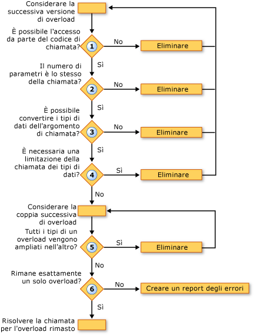

# Risoluzione dell'overload (Visual Basic)
Quando il [!INCLUDE[vbprvb](../../../../csharp/programming-guide/concepts/linq/includes/vbprvb_md.md)] viene rilevata una chiamata a una routine che viene definita in diverse versioni di overload, il compilatore deve decidere quale overload chiamare. A tale scopo, eseguire le operazioni seguenti:  
  
1.  **Accesso facilitato.** Elimina tutti gli overload con un livello di accesso che impedisce la chiamata al codice chiamante.  
  
2.  **Numero di parametri.** Eliminazione di eventuali overload che definisce un numero di parametri diverso rispetto a quello fornito nella chiamata.  
  
3.  **Tipi di dati di parametro.** Il compilatore assegna preferenza metodi di istanza sui metodi di estensione. Se viene trovato alcun metodo di istanza che richiede solo di ampliamento per rispondere alla chiamata di procedura, vengono eliminati tutti i metodi di estensione e il compilatore continua con solo i candidati dei metodi di istanza. Se non viene trovato alcun tale metodo di istanza, continua con l'istanza sia metodi di estensione.  
  
     In questo passaggio, eliminazione di eventuali overload per il quale i tipi di dati degli argomenti di chiamata non convertiti per i tipi di parametri definiti nell'overload.  
  
4.  **Conversioni di restrizione.** Eliminazione di eventuali overload che richiede una conversione dai tipi di argomento chiamante per i tipi di parametro definito. Ciò vale se passare il controllo dei tipi ([istruzione Option Strict](../../../../visual-basic/language-reference/statements/option-strict-statement.md)) è `On` o `Off`.  
  
5.  **Ampliamento minimi.** Il compilatore considera gli overload rimanenti a coppie. Per ogni coppia, confronta i tipi di dati dei parametri definiti. Se i tipi in uno degli overload tutti vengano ampliati ai tipi corrispondenti in altro, il compilatore elimina quest'ultimo. Vale a dire, viene mantenuto l'overload che richiede l'ampliamento.  
  
6.  **Candidato singolo.** Vengono presi in considerazione gli overload a coppie fino a quando solo uno overload rimane, e la chiamata a questo overload viene risolta. Se il compilatore non è possibile ridurre gli overload a uno solo, viene generato un errore.  
  
 Nella figura seguente viene illustrato il processo che determina quale versione di un set di versioni di overload chiamare.  
  
   
Risoluzione delle versioni di overload  
  
 Nell'esempio seguente viene illustrato questo processo di risoluzione dell'overload.  
  
 [!code-vb[&#62; VbVbcnProcedures](./codesnippet/VisualBasic/overload-resolution_1.vb)]  
  
 [!code-vb[&#63; VbVbcnProcedures](./codesnippet/VisualBasic/overload-resolution_2.vb)]  
  
 Nella prima chiamata, il compilatore elimina il primo overload poiché il tipo del primo argomento (`Short`) viene convertito nel tipo del parametro corrispondente (`Byte`). Viene quindi eliminato il terzo overload poiché ogni tipo di argomento nel secondo overload (`Short` e `Single`) può ampliarsi nel tipo corrispondente del terzo overload (`Integer` e `Single`). Il secondo overload richiede un ampliamento minore, pertanto verrà utilizzato dal compilatore per la chiamata.  
  
 Nella seconda chiamata, il compilatore non può eliminare uno degli overload sulla base di restrizione. Viene eliminato il terzo overload per lo stesso motivo della prima chiamata, poiché può chiamare il secondo overload con un ampliamento minore dei tipi di argomento. Tuttavia, il compilatore non può risolvere tra il primo e il secondo overload. Ognuno dispone di un tipo di parametro definito che amplia al tipo corrispondente in altro (`Byte` a `Short`, ma `Single` a `Double`). Pertanto, il compilatore genera un errore di risoluzione dell'overload.  
  
## Di overload facoltativa e argomenti ParamArray  
 Se due overload di una routine hanno firme identiche ad eccezione del fatto che l'ultimo parametro è dichiarato [facoltativo](../../../../visual-basic/language-reference/modifiers/optional.md) in uno e [ParamArray](../../../../visual-basic/language-reference/modifiers/paramarray.md) in altro, il compilatore risolve una chiamata a procedura come indicato di seguito:  
  
|Se la chiamata viene fornito come ultimo argomento|Il compilatore risolve la chiamata dell'overload dichiarando l'ultimo argomento come|  
|---|---|  
|Nessun valore (argomento omesso)|`Optional`|  
|Valore singolo|`Optional`|  
|Due o più valori in un elenco delimitato da virgole|`ParamArray`|  
|Matrice di qualsiasi lunghezza (inclusa una matrice vuota)|`ParamArray`|  
  
## Vedere anche  
 [Parametri facoltativi](./optional-parameters.md)   
 [Matrici di parametri](./parameter-arrays.md)   
 [Overload di routine](./procedure-overloading.md)   
 [Le procedure di risoluzione](./troubleshooting-procedures.md)   
 [Procedura: definire più versioni di una routine](./how-to-define-multiple-versions-of-a-procedure.md)   
 [Procedura: chiamare una routine di overload](./how-to-call-an-overloaded-procedure.md)   
 [Procedura: eseguire l'Overload di una routine che accetta parametri facoltativi](./how-to-overload-a-procedure-that-takes-optional-parameters.md)   
 [Procedura: eseguire l'Overload di una routine che accetta un numero indefinito di parametri](./how-to-overload-a-procedure-that-takes-an-indefinite-number-of-parameters.md)   
 [Considerazioni sull'overload di routine](./considerations-in-overloading-procedures.md)   
 [Overload](../../../../visual-basic/language-reference/modifiers/overloads.md)   
 [Metodi di estensione](./extension-methods.md)
