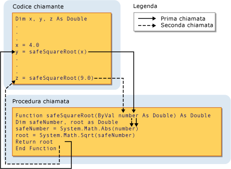

# Procedure Parameters and Arguments (Visual Basic)
[!INCLUDE[vs2017banner](../../../../csharp/includes/vs2017banner.md)]

Nella maggior parte dei casi una routine richiede alcune informazioni sulle circostanze in cui è stata chiamata.  Una routine che esegue attività ripetute o condivise utilizza informazioni diverse per ogni chiamata.  Tali informazioni sono costituite da variabili, costanti ed espressioni passate alla routine al momento della chiamata.  
  
 Un *parametro* rappresenta un valore da fornire alla routine al momento della chiamata.  La dichiarazione della routine ne definisce i parametri.  
  
 È possibile definire una routine senza parametri oppure con uno o più parametri.  La parte della definizione della routine in cui sono specificati i parametri è denominata *elenco di parametri*.  
  
 Un *argomento* rappresenta il valore fornito al parametro di una routine quando quest'ultima viene chiamata.  Gli argomenti vengono forniti dal codice chiamante al momento della chiamata.  La parte della chiamata di routine in cui sono specificati gli argomenti è definita *elenco di argomenti*.  
  
 Nell'illustrazione riportata di seguito è rappresentato il codice che chiama la routine `safeSquareRoot` da due posizioni diverse.  Nella prima chiamata il valore della variabile `x` \(4.0\) viene passato al parametro `number`, quindi il valore restituito in `root` \(2.0\) viene assegnato alla variabile `y`.  Nella seconda chiamata il valore letterale 9.0 viene passato a `number`, quindi il valore restituito \(3.0\) viene assegnato alla variabile `z`.  
  
   
Passaggio di un argomento a un parametro  
  
 Per ulteriori informazioni, vedere [Differences Between Parameters and Arguments](../../../../visual-basic/programming-guide/language-features/procedures/differences-between-parameters-and-arguments.md).  
  
## Tipo di dati dei parametri  
 La definizione di un tipo di dati per un parametro avviene mediante la specifica della clausola `As` nella relativa dichiarazione.  La funzione che segue, ad esempio, accetta una stringa e un Integer.  
  
 [!code-vb[VbVbcnProcedures#32](../../../../visual-basic/programming-guide/language-features/procedures/codesnippet/VisualBasic/procedure-parameters-and-arguments_1.vb)]  
  
 Se l'opzione di controllo dei tipi \([Option Strict Statement](../../../../visual-basic/language-reference/statements/option-strict-statement.md)\) è `Off,` la clausola `As` è facoltativa, a meno che non venga utilizzata da qualche parametro e di conseguenza debba essere utilizzata da tutti i parametri.  Se il controllo dei tipi è `On`, la clausola `As` è obbligatoria per tutti i parametri di routine.  
  
 Se il codice chiamante prevede la specifica di un argomento con un tipo di dati diverso da quello del parametro corrispondente, ad esempio `Byte` a un parametro `String`, deve eseguire una delle seguenti operazioni:  
  
-   Specificare solo argomenti con tipi di dati che vengano convertiti nel tipo di dati più grande del parametro corrispondente.  
  
-   Impostare `Option Strict Off` in modo da consentire conversioni implicite in tipi di dati più piccoli.  
  
-   Oppure utilizzare una parola chiave di conversione per convertire in modo esplicito il tipo di dati.  
  
### Parametri di tipo  
 Una *routine generica* definisce inoltre uno o più *parametri di tipo* oltre ai normali parametri.  Una routine generica consente al codice chiamante di passare tipi di dati diversi ogni volta che chiama la routine, in modo che i tipi di dati possano essere adattati ai requisiti di ciascuna singola chiamata.  Per informazioni, vedere [Generic Procedures in Visual Basic](../../../../visual-basic/programming-guide/language-features/data-types/generic-procedures.md).  
  
## Vedere anche  
 [Procedures](../../../../visual-basic/programming-guide/language-features/procedures/index.md)   
 [Sub Procedures](../../../../visual-basic/programming-guide/language-features/procedures/sub-procedures.md)   
 [Routine Function](../../../../visual-basic/programming-guide/language-features/procedures/function-procedures.md)   
 [Routine Property](../../../../visual-basic/programming-guide/language-features/procedures/property-procedures.md)   
 [Operator Procedures](../../../../visual-basic/programming-guide/language-features/procedures/operator-procedures.md)   
 [How to: Define a Parameter for a Procedure](../../../../visual-basic/programming-guide/language-features/procedures/how-to-define-a-parameter-for-a-procedure.md)   
 [How to: Pass Arguments to a Procedure](../../../../visual-basic/programming-guide/language-features/procedures/how-to-pass-arguments-to-a-procedure.md)   
 [Passing Arguments by Value and by Reference](../../../../visual-basic/programming-guide/language-features/procedures/passing-arguments-by-value-and-by-reference.md)   
 [Procedure Overloading](../../../../visual-basic/programming-guide/language-features/procedures/procedure-overloading.md)   
 [Type Conversions in Visual Basic](../../../../visual-basic/programming-guide/language-features/data-types/type-conversions.md)